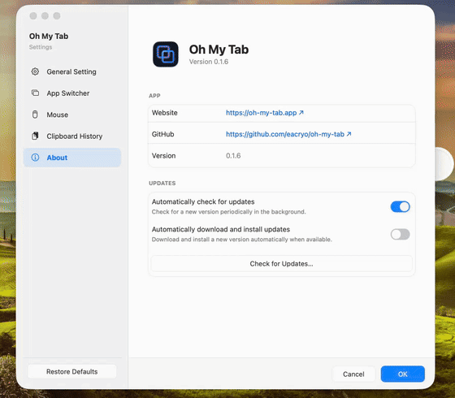

<p align="center">
  
</p>

<br />

<div align="center"><b>——&nbsp;&nbsp;&nbsp;面向 macOS 的桌面效率工具箱：窗口切换、鼠标控制、历史剪贴板与快捷操作&nbsp;&nbsp;&nbsp;——</b></div>

<br />

<p align="center">
  <a href="https://github.com/eacryo/oh-my-tab/releases"></a>
  <a href="LICENSE"></a>
  <a href="https://github.com/eacryo/oh-my-tab"></a>
</p>

<br />

<p align="center">
  简体中文 | <a href="README.md">English</a>
</p>

<p align="center">
  官方网站：<a href="https://oh-my-tab.app/">oh-my-tab.app</a>
</p>

<br />

oh-my-tab 是一套 Rust 原生开发的 macOS 桌面效率工具箱，没有使用 Electron 或 Tauri，集成了 Windows / macOS 风格的窗口切换器、鼠标控制、历史剪贴板、窗口控制与快捷操作。

-  **窗口切换器**：显示应用名与窗口标题，每个窗口一张卡片，支持多显示器。
-  **窗口缩略图**：标题行在上方、下方为 16:10 实时预览（经私有 WindowServer API 截取，仅存内存）——缓存帧即时显示、后台异步刷新；单页时平衡排列，溢出时按 MRU 顺序填满并连续滚动。需要**屏幕录制**权限——未授权时自动回退为纯图标卡片。关闭缩略图后会立即释放内存中的窗口截图。
-  **窗口级 MRU**：切换某个窗口时，该应用的其他窗口保持原有顺序。
-  **完整窗口可见**：所有真实窗口，包含离屏与最小化窗口（可开关）。
-  **灵活导航**：支持 Tab、Shift+Tab、方向键和鼠标；快捷键可切换为 Option+Tab。
-  **窗口控制**：通过 Option+方向键最大化、分屏、四分屏和最小化窗口；Option+Shift+方向键可把窗口移到相邻显示器。
-  **快捷操作**：Option+I 打开设置、Option+E 打开访达、Option+D 显示桌面、Option+L 锁屏，双击 Control 定位鼠标。
-  **历史剪贴板**（可选）：文本、图片和文件条目——搜索、置顶、删除、过期与持久化（[剪贴板历史](#剪贴板历史)）。
-  **鼠标控制**（可选）：滚动模式、反向滚动、按设备禁用指针加速，以及**侧键 → 快捷键映射**。
-  **外观定制**：浅色、深色或跟随系统主题，以及 Liquid Glass 样式（`NSGlassEffectView`，旧系统回退 `NSVisualEffectView`）、色调、圆角和字号。
-  **设置中心**：在设置窗口中统一管理外观与各功能，修改后即时应用。
-  **多语言**：简体中文、繁体中文和英文，跟随系统语言。
-  **轻量**：纯 Rust，配有上限明确的内存缩略图缓存——无 Electron/Tauri 运行时。
-  **日志**：保留 30 天（[日志](#日志)）。

## 通过 Homebrew 安装

如果只是使用、不需要从源码构建，可以通过 Homebrew Cask 安装预编译版本：

```sh
brew install --cask eacryo/tap/oh-my-tab
```

需要 macOS 13+ 和 Apple Silicon。更新与卸载：

```sh
brew upgrade --cask oh-my-tab
brew uninstall --cask oh-my-tab
```

## 截图

<div align="center"></div>

<div align="center"></div>

## 快速使用

- **窗口切换**：按住 Command（可在设置中改为 Option），按 Tab / Shift+Tab 或方向键选择窗口，松开修饰键完成切换。
- **历史剪贴板**：开启后按 **Option+V** 呼出；支持键盘和鼠标操作，点击浮窗外部关闭。
- **权限**：窗口切换需要辅助功能权限；缩略图需要屏幕录制权限。缺少屏幕录制权限时不影响窗口切换，只显示图标卡片。

剪贴板持久化默认关闭。开启后会以明文保存文本、文件名和图片数据；如果你会复制密码或令牌，请不要开启。完整说明见[官方网站](https://oh-my-tab.app/)。

## &nbsp;&nbsp;剪贴板历史

可选功能（默认关闭）。**Option+V** 呼出，用方向键 / Enter / Esc / Backspace 或鼠标操作，点击浮窗外部关闭。附加按键：**← 置顶/取消置顶**选中条目；**→ 在主浮窗旁展开详情面板**——完整未截断的文本或图片大图（跟随 ↑/↓ 浏览实时切换；按 Esc、←、→ 或点击面板关闭）。历史记录**三种条目**：

| 种类 | 存储内容 | 粘贴行为 |
|---|---|---|
| **文本** | 复制的文本，存于内存 | 写回文本并合成 Cmd+V |
| **图片数据** | 在应用内复制的图片（如右键“复制图片”）：原始格式字节按内容哈希存磁盘缓存，内存只留降采样缩略图 | 按**原始 UTI** 写回字节并保留格式：JPG 仍为 JPG，GIF 动图仍为 GIF |
| **图片文件** | 在访达里复制的图片文件（Cmd+C）：复制时**读一次文件**算内容哈希并生成缩略图，字节随即丢弃——只保留路径 | 恢复 `public.file-url`（文件语义，同 Windows Win+V / Maccy）：Finder 原样复制文件，聊天应用附加文件；源文件已被删除时跳过粘贴 |

> **已知 v1 取舍**——每条历史只记录一种内容：一次复制**同时带文本和图片**时（例如从网页复制图片）只记录文本；**多文件复制与单个非图片文件会从历史中跳过**。同一张图既复制过图片又复制过文件，则保留两条（两者的粘贴语义不同）。去重按类进行：文本按全文精确匹配，图片按内容哈希。

**使用条目默认会重排历史**（同 Maccy）：选中条目回车 = 把它写回剪贴板，记录器视为“又一次复制”并移到最前。设置里的**“使用后移到最前”**开关可关闭此行为（同 Windows Win+V）。开启**“粘贴后删除条目”**后，按住 **Option** 再回车或点按条目会粘贴并立即从历史中移除（一次性粘贴）。其从属开关**“同时删除系统剪贴板中对应条目”**会在短暂延迟后删除对应内容，但如果期间已有更新复制则不会删除。浮窗的“清空历史”保留置顶条目。可选的**“保存剪贴板历史记录到磁盘”**开关会把历史持久化、重启不丢——隐私风险见上方「快速使用」中的说明。

## 已知问题

- 后台 WebView 应用偶尔只能提供标题栏或白色内容区。应用会保留上一张有效缩略图，激活窗口后再尝试刷新。
- Telegram 全屏图片查看器属于特殊高层级浮窗，不会作为独立窗口展示；切换器显示 Telegram 主窗口。
- 某些编辑器或受保护窗口禁止共享画面，即使已授予屏幕录制权限也可能只有占位图或上一张有效画面，但窗口仍可切换。
- 启动时若已有窗口，初始排序不保证与原生 Cmd+Tab 完全一致；运行后会通过激活事件逐步修正窗口级 MRU。

仅影响源码开发的问题见[开发环境说明](docs/developer-notes.md)。

## 环境要求与权限

- macOS 13+ Apple Silicon。
- **辅助功能**权限：用于全局快捷键事件 tap 和 AX 窗口查询。在“系统设置 → 隐私与安全性 → 辅助功能”中授予。
- **屏幕录制**权限：用于窗口缩略图。在“系统设置 → 隐私与安全性 → 屏幕录制”中授予；画面帧只保存在内存中。

如果事件 tap 创建失败，应用会打印一条错误，快捷键会静默失效，原因通常是未授予辅助功能权限。图标缓存位于 `~/Library/Caches/oh-my-tab-icons/`。

## 设置

所有功能选项推荐在设置窗口中修改，修改后会立即应用。设置页包含外观、窗口切换、窗口控制、快捷操作、剪贴板、鼠标、开机启动和自动更新等部分。

剪贴板持久化的行为和隐私说明见上方说明及[官方网站](https://oh-my-tab.app/)。

## 从源码构建

开发者可以使用以下命令检查和运行项目：

```sh
cargo fmt
cargo check
cargo clippy
cargo test
./scripts/dev-restart.sh
```

`scripts/dev-restart.sh` 会构建并组装独立签名的开发版 `.app`，再交给用户级 `launchd` 启动，这样辅助功能与屏幕录制授权会绑定到开发版 bundle，并确保实际运行的是最新构建。布局 QA 夹具、调试期的布局断言和 GUI 冒烟测试见[开发环境说明](docs/developer-notes.md)。

如需生成可分发的 `.app` 与 `.dmg`，运行 `sh scripts/bundle.sh`。完整发布流程（含 `--push`）、开发通道、Sparkle 更新与代码签名见[发布流程](docs/releasing.md)。

## 日志

默认日志路径为 `~/Library/Logs/oh-my-tab/oh-my-tab.log`，日志会自动轮转并保留最新的 5 个备份。需要排查问题时，可在设置窗口将日志级别切换为 Debug；日志不包含剪贴板内容和窗口画面。内存采样字段和开发调试说明见[开发环境说明](docs/developer-notes.md)。

## 致谢

**鼠标控制**功能参考了 [LinearMouse](https://github.com/linearmouse/linearmouse)。**窗口切换器**的浮层设计、卡片式选中和 Liquid Glass 风格参考了 [BetterCmdTab](https://github.com/rokartur/BetterCmdTab)。感谢两个项目及其作者。
