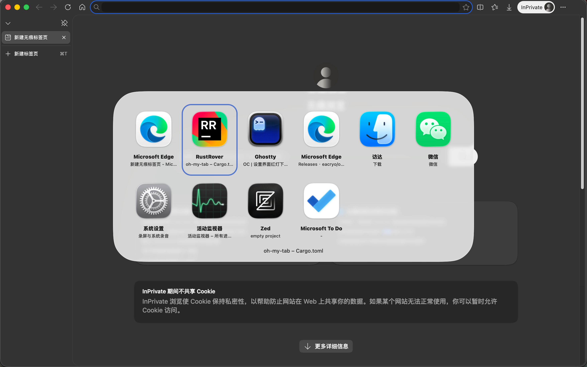
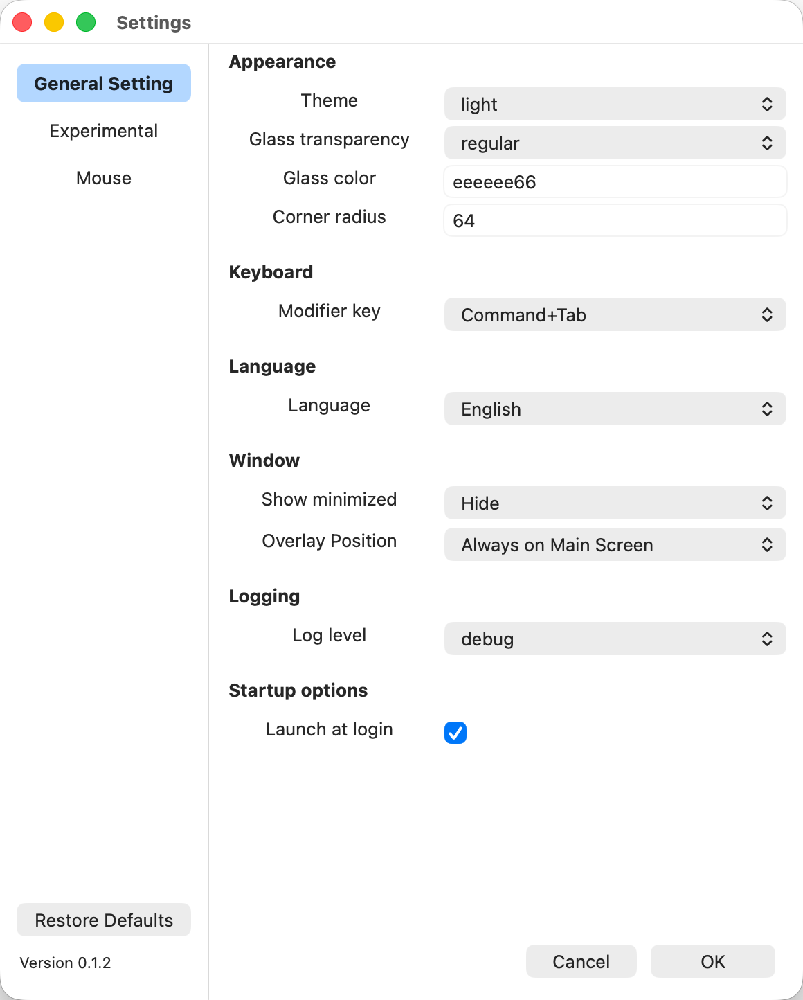

# oh-my-tab

> 简体中文 | [English](README.md)

一个 macOS 窗口切换器 -- 系统 Cmd+Tab 的替代品。它以**菜单栏辅助应用**方式运行(无 Dock 图标),拦截全局快捷键(默认 **Command+Tab**,可切换为 Option+Tab),弹出一个 **Liquid Glass** 风格的浮层,以卡片形式展示当前打开的窗口,松开快捷键时通过辅助功能(Accessibility,AX)API 把选中的窗口抬到最前。

它是纯 Rust 通过 `objc2` FFI 直接调用 AppKit / CoreGraphics / ApplicationServices -- 没有 Swift 桥接,也没有 Rust UI 框架。

## 功能特性

- 对于系统原生窗口切换的增强，可以显示应用名称和窗口标题（无标题时使用-显示）同一个应用打开多个窗口时，可以分列在窗口切换界面
- 按下Command或Option后，可以通过Tab键以及上下左右方向键和鼠标指针移动选中窗口
- 纯Rust调用MacOS api，没有Electron，没有Tauri，带来了仅1.5MB的体积大小和35MB的内存占用
- 浮层 Liquid Glass 效果，因此只在MacOS 26上测试过，更低版本不保证可用性。
- **窗口级** MRU 排序 -- 每个窗口按 `(pid, CGWindowID)` 独立追踪,切到某 App 的一个窗口时不会把该 App 的其它窗口一起带到前面。
- 窗口切换界面支持显示最小化窗口和和隐藏最小化窗口，开启时置灰最小化窗口的图标
- TOML 配置,校验后可从菜单**热重载**。
- 手写、零依赖的国际化(英文、简体中文、繁体中文),自动检测系统语言并实时跟随。
- 每次启动一个日志文件,自动保留 30 天(见[日志](#日志))。

## 截图





## 已知问题
如果应用启动时已经有窗口存在，此时窗口排序与原生的Command加Tab排序不同，
这是由于没有初始的窗口排序数据导致的，oh-my-tab启动后会持续监听窗口的变化

## 环境要求

- macOS(在 macOS 26 上开发;旧版本通过 `NSVisualEffectView` 回退支持，但不保证其可用性)。
- 已授予应用 **辅助功能** 权限。

## 构建与运行

**前置条件:** Rust 稳定版工具链、Xcode Command Line Tools(`xcode-select --install`)、macOS 13+。运行时需要辅助功能权限(见下方「权限与运行须知」)。

### 开发

```sh
cargo check       # 快速类型检查
cargo run         # 构建并运行(会接管全局快捷键)
cargo clippy      # 可用,未接入 CI
```

`cargo run` 以**开发模式**跑裸二进制:日志输出到 stdout(不写文件),开机自启不生效(SMAppService 需要 `.app` bundle)。项目**没有测试**。

### Release `.app` + `.dmg`

```sh
sh scripts/bundle.sh        # cargo build --release -> dist/oh-my-tab.app -> 签名 -> dist/oh-my-tab.dmg
open dist/oh-my-tab.dmg     # 安装:把 Oh My Tab 拖到 Applications
```

`bundle.sh` 组装 `dist/oh-my-tab.app`(二进制 + `Info.plist`)、做签名,再打成 `dist/oh-my-tab.dmg`(含 `Applications` 软链,拖拽安装)。两个产物都在 `dist/`(已 gitignore),放在 `target/` 之外,这样 logger 把它识别为生产态(写文件日志,而非 stdout)。运行 `.app` 是开机自启(SMAppService)和文件日志的前提;`.dmg` 用于分发。

代码改动后需要**重新跑 `sh scripts/bundle.sh`**(bundle 在构建时拷贝 release 二进制)。脚本会自定位仓库根,可从任意目录运行;它引用 `assets/Info.plist`、写入 `dist/`。

### 代码签名

`bundle.sh` 优先用自签名身份 **`oh-my-tab-sign`** 签名,没有该证书时退回 ad-hoc(`codesign -s -`)。**强烈建议**一次性创建该证书 -- 它能让辅助功能授权在反复 rebuild 后仍然稳定。

**原因:** ad-hoc 签名应用的指定要求只是裸 CDHash,每次 rebuild 都变。macOS TCC 按该 CDHash 记辅助功能授权,所以每次 rebuild 都会让授权失效(TCC 日志报 `Failed to match existing code requirement` / `errSecCSReqFailed`),旧安装残留的条目还会雪上加霜。自签名证书让指定要求变成证书型(`certificate leaf = H"..."`),rebuild 不变,授权就稳了。

**一次性创建证书**(钥匙串访问):

1. *钥匙串访问 -> 证书助理 -> 创建证书…*
2. 名称:`oh-my-tab-sign`,身份类型:**自签名根**,证书类型:**代码签名**。
3. 创建。(首次跑 `bundle.sh` 可能弹钥匙串访问提示 -- 点「始终允许」。)

然后重新打包、重装、授予辅助功能一次。之后每次 rebuild 用的是同一个证书身份,**无需再重新授权**。若授权变陈旧(比如旧 ad-hoc 安装残留),清除:

```sh
tccutil reset Accessibility com.eacryo.oh-my-tab
```

**注意:** 自签名证书只稳定 TCC 身份,**不**满足 Gatekeeper 分发 -- 别人装仍是「未识别开发者」,需右键打开。要彻底解决分发得用付费的 Apple **Developer ID Application** 证书;有的话把 `scripts/bundle.sh` 里的 `SIGN_IDENTITY` 改成那个名字。

## 应用图标

应用图标(`AppIcon.icns`)由 `assets/icon.svg` 生成,打包进 `Contents/Resources/`。`assets/AppIcon.icns` 已提交进仓库,`bundle.sh` 直接使用它,因此贡献者构建 `.app` 时无需任何额外工具。

编辑 `assets/icon.svg` 后重新生成:

```sh
./scripts/build-icon.sh        # SVG -> 10 张 .iconset PNG(scripts/svg2png.swift) -> assets/AppIcon.icns
```

需要 `swift`(Xcode 或 Swift 工具链)+ `iconutil`(Xcode CLT)。刻意不用 `qlmanage` -- 它会把 SVG 合成到不透明白底上,导致圆角 squircle 外出现白边。`scripts/svg2png.swift` 用 `NSImage`/WebKit 在每个目标尺寸原生光栅化,保留透明圆角。生成后把新的 `assets/AppIcon.icns` 连同 `assets/icon.svg` 改动一起提交。

## 权限与运行须知

- 应用需要 **辅助功能** 权限(`AXIsProcessTrusted`),全局按键事件 tap 和 AX 窗口查询都依赖它。在 *系统设置 -> 隐私与安全性 -> 辅助功能* 中授予。重新编译出的二进制需要重新授权 -- 除非用稳定身份签名(见[代码签名](#代码签名)),此时授权跨 rebuild 持续有效。
- 如果事件 tap 创建失败,应用会打印一条错误,快捷键静默失效 -- 几乎总是辅助功能权限没给。
- 运行时配置:`~/.config/oh-my-tab/config.toml`(首次运行自动按默认值创建)。
- 图标缓存:`~/Library/Caches/oh-my-tab-icons/{pid}.png`。

## 架构

代码按职责拆成若干模块。关键逻辑跨多个文件,下面的拆分是承重的。

### 事件流与线程(跨所有文件)

1. `event_monitor` 起一个**专用线程**跑 `CGEventTap` + `CFRunLoop`,检测快捷键按下(`CmdTabPressed`)和修饰键松开(`CmdReleased`),通过 `flume` 通道发送 `GlobalEvent`。当前快捷键(Cmd 或 Opt)由 `SHORTCUT_IS_CMD` 原子量决定,可从菜单切换。
2. **桥接线程**从 flume 收 `GlobalEvent`,通过 `performSelectorOnMainThread:` 转交主线程上的 controller 对象(`OhMyTabController`)。
3. **主线程**跑 `NSApplication.run`,拥有所有 UI:ObjC 回调负责构建/刷新/显示浮层。

共享状态放在全局 `static` 里,由 `Mutex` / `RwLock` 守护:`TAB_STATE`(窗口 + 选中 + MRU)、各 ObjC 对象指针、`CARD_INDEX_MAP`、`CONFIG`、`LAST_ACTIVATED`。裸 ObjC 指针用 `ObjPtr` / `ObjClassPtr` 包装并手动实现 `Send` / `Sync`。

### 模块

| 模块 | 职责 |
| --- | --- |
| `main.rs` | ObjC 类注册、`NSApplication` 初始化、状态栏菜单、浮窗创建、`NSWorkspace` / `NSLocale` 通知监听、整体编排。 |
| `event_monitor.rs` | 专用线程上的 `CGEventTap`;快捷键按下/松开检测;`GlobalEvent` 通道。 |
| `overlay.rs` | 浮窗、卡片视图、键盘/鼠标导航、渲染、主题应用、窗口激活。 |
| `window_collector.rs` | `CGWindowList` + AX 枚举、图标提取/缓存、MRU、通过 SkyLight 私有 API 抬升窗口。 |
| `config.rs` | TOML 配置,校验,逐字段容错,可热重载。 |
| `i18n.rs` | 手写 TOML 国际化,编译期内嵌,自动检测语言。 |
| `settings.rs` | 设置窗口(控件、校验告警、配置热应用)。 |
| `menu.rs` | 状态栏菜单及动作回调。 |
| `logger.rs` | 异步日志(有界通道、后台 writer 线程)。 |
| `ffi.rs` / `theme.rs` | FFI 基础工具(CF/CG/NSString helper、`Send`/`Sync` 包装)与主题/布局访问器。 |

### 关键设计点

- **AX 为权威数据源**做窗口过滤:CG 窗口必须能通过私有 `_AXUIElementGetWindow` 按 `CGWindowID` 配对到一个 AX `AXStandardWindow`,从而丢弃弹出面板/下拉菜单。
- **无标题窗口**:自绘标题栏的 App(如 Microsoft To Do)`AXTitle` 为空;这类窗口通过 `titleless_pids` 集合保留,只有*显示层*用占位符 `"-"` 替换。内部存储的标题保持空串,这样 `raise_ax_window` 仍能按空标题匹配到 AX 窗口。
- **macOS 版本分流**:macOS 26+ 用 `NSGlassEffectView`(Liquid Glass);旧版回退到 `NSVisualEffectView`(withinWindow + Dark)。
- **部分调用使用原生 `objc_msgSend` FFI**,因为 `objc2` 的 `msg_send!` 无法编码 CF/CG 类型或 void 返回。

## 配置

`~/.config/oh-my-tab/config.toml` -- 首次运行按默认值自动创建。加载是**逐字段容错**的,不是全有或全无:非法字段回退到默认值(记日志,绝不致命)。可从菜单(*Reload Config*)运行时热重载,同时重新应用主题并刷新浮窗。

```toml
[appearance]
theme = "light"          # "dark" | "light" | "auto"
glass_style = "clear"    # "regular" | "clear"
glass_tint = "eeeeee66"  # RRGGBBAA
corner_radius = 64.0

[layout]
cards_per_row = 6
card_width = 140.0
card_height = 180.0
card_gap = 0.0
icon_size = 110.0

[colors]
# 每套配色包含:status_bar_text, app_name, win_title, icon_inner_bg,
# icon_text, card_bg_sel, card_border_sel -- 均为 RRGGBBAA。
[colors.dark]
status_bar_text = "999999ff"
app_name        = "ddddddff"
win_title       = "888888ff"
icon_inner_bg   = "22224444"
icon_text       = "9999bbff"
card_bg_sel     = "22224444"
card_border_sel = "5577ccff"
[colors.light]
status_bar_text = "333333ff"
app_name        = "1a1a1aff"
win_title       = "333333ff"
icon_inner_bg   = "d0d0e066"
icon_text       = "666688ff"
card_bg_sel     = "ffffff66"
card_border_sel = "5577ccff"

[fonts]
status_bar_size   = 13.0
status_bar_weight = 0.23
title_size        = 11.0
title_weight      = 0.23
app_name_size     = 13.0
app_name_weight   = 0.5

[keyboard]
modifier = "option"      # "option"(Option+Tab)| "command"(Cmd+Tab)

[i18n]
locale = "auto"          # "auto" | "en" | "zh-Hans" | "zh-Hant"

[windows]
show_minimized = false   # 在浮层中显示最小化窗口

[logging]
level = "info"           # "info" | "warn" | "error"
file_path = ""           # 空 = 默认带时间戳路径;见下方「日志」

[startup]
launch_at_login = false  # 开机自启(需以 .app 方式运行;macOS 13+)
```

## 日志

日志是异步的,设计上**绝不阻塞 UI / 事件循环**。

- **异步管线**:`log_info!` / `log_warn!` / `log_error!` 宏格式化一行后,通过**有界** `flume` 通道(容量 512)发给后台 writer 线程。调用方永不阻塞 -- 通道满时(例如落盘卡顿)丢弃**最新**的日志(drop-newest),而不是拖住调用方。正常负载下不会触发丢弃。
- **输出目标**:`cargo run`(开发态)-> 只输出到 stdout;打包的 `.app`(生产态)-> 写文件。
- **默认文件路径**:`~/Library/Logs/oh-my-tab/oh-my-tab-<启动时间戳>.log` -- **每次启动一个文件**,时间戳取进程启动时刻、文件名安全格式(如 `oh-my-tab-2026-07-25_17-08-30.log`)。
- **自动清理 30 天前日志**:启动时扫描默认日志目录,删除任何 mtime 超过 30 天的 `oh-my-tab-*.log`。当前运行的文件不会被误删(它一直在写,mtime 持续更新)。清理只匹配 `oh-my-tab-*.log` 模式,同目录下的无关文件不受影响。
- **单次长时间运行内**文件仍会增长 -- 没有按大小轮转。30 天清理是跨运行、按 mtime 进行的。

### 自定义日志路径 -- 以及为什么应用绝不碰它

`[logging] file_path` 允许你通过直接编辑 `config.toml` 覆盖日志目标位置。它**不在设置界面里暴露** -- 要改的话,自己编辑 `~/.config/oh-my-tab/config.toml` 即可。

当 `file_path` 非空时,logger **原样**使用该路径,以 append 模式写入。关键点:

- **不会**给用户指定的路径加时间戳。
- **不会**对它做任何清理。

应用刻意**绝不往用户指定的位置写入额外文件,也绝不删除其中的任何文件。** 如果你把 `file_path` 指向自己的文件或目录,轮转和保留由你自己负责 -- 30 天自动清理*只*作用于默认目录 `~/Library/Logs/oh-my-tab/`。这样 logger 就不会在你显式选择接管的位置上,用创建或删除文件来给你制造意外。

## 国际化

- 手写 TOML,零依赖,编译期内通过 `include_str!` 从 `locales/{en,zh-Hans,zh-Hant}.toml` 内嵌(无运行时文件 IO,无缺文件风险)。
- 由 `config.i18n.locale` 驱动:`"auto"`(默认)| `"en"` | `"zh-Hans"` | `"zh-Hant"`。`"auto"` 从系统 `NSLocale` 首选语言解析(按顺序扫描)。
- **热重载**:配置重载时、以及 `locale` 为 `auto` 时系统语言变更,都会刷新菜单和设置窗口的文案。
- **新增语言**:创建 `locales/xx.toml`(同样的 key),在 `i18n::locale_raw()` 注册,在 `config.rs` 的 `validate()` 白名单里加入,并在 `map_tag_to_supported()` 里扩展(如果希望 `auto` 把某系统 tag 映射到它)。

## 图标缓存

`~/Library/Caches/oh-my-tab-icons/{pid}.png` -- 按 **PID** 索引,"文件存在即有效"(无 TTL):App 更新必然以新 PID 重启,从而强制重新提取。启动时预缓存,并在 `NSWorkspaceDidLaunchApplicationNotification` 时补提取。可从菜单(*Clear Icon Cache*)清空。


## 仓库

https://github.com/eacryo/oh-my-tab
