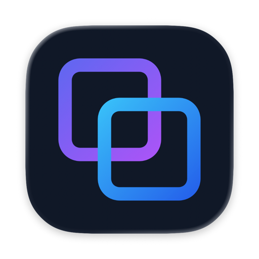
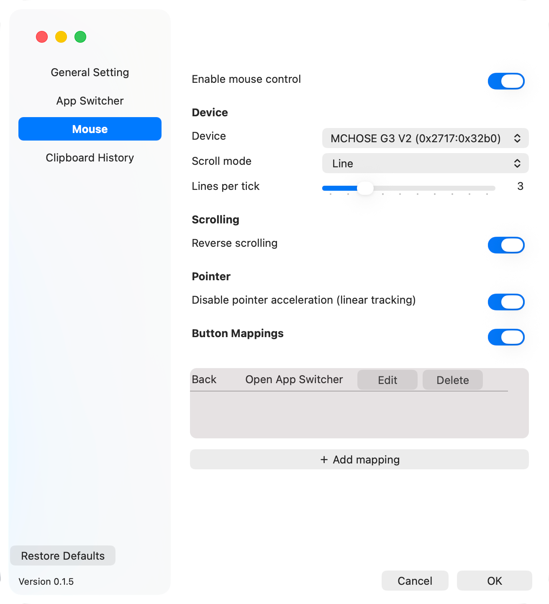
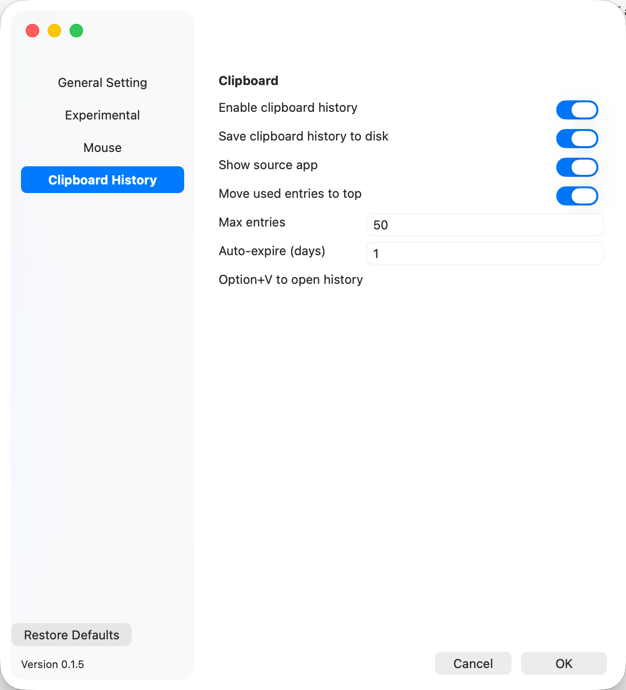
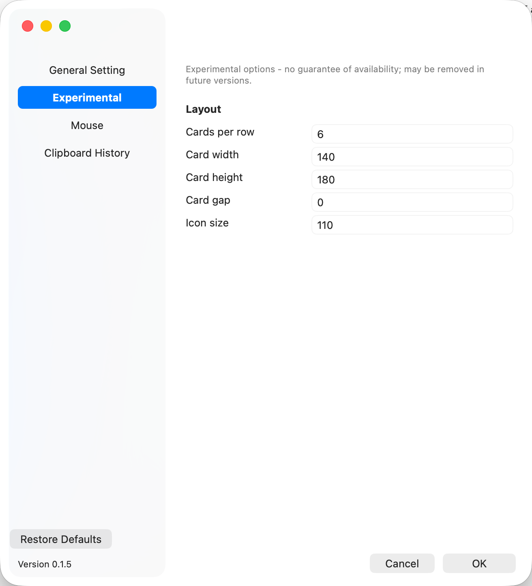

<p align="center">
  
</p>

<br />

<div align="center"><b>——&nbsp;&nbsp;&nbsp;纯 Rust 的 macOS 应用切换器、剪贴板历史与鼠标控制&nbsp;&nbsp;&nbsp;——</b></div>

<br />

<p align="center">
  <a href="https://github.com/eacryo/oh-my-tab/releases"></a>
  <a href="LICENSE"></a>
  <a href="https://github.com/eacryo/oh-my-tab"></a>
</p>

<br />

> 简体中文 | [English](README.md)

<br />

一个 macOS 窗口切换器 -- 系统 Cmd+Tab 的替代品。它以**菜单栏辅助应用**方式运行(无 Dock 图标),拦截全局快捷键(默认 **Command+Tab**,可切换为 Option+Tab),弹出一个 **Liquid Glass** 风格的浮层,以卡片形式展示当前打开的窗口,松开快捷键时通过辅助功能(Accessibility,AX)API 把选中的窗口抬到最前。

它是纯 Rust 通过 `objc2` FFI 直接调用 AppKit / CoreGraphics / ApplicationServices -- 没有 Swift 桥接,也没有 Rust UI 框架。

-  **原生切换增强**:显示应用名与窗口标题,同一应用的多个窗口分列卡片。
-  **键盘导航**:按下 Command/Option 后用 Tab、方向键或鼠标选择窗口。
-  **轻量**:纯 Rust——1.5MB 体积、约 35MB 内存,无 Electron/Tauri。
-  **Liquid Glass**:浮层效果(仅 macOS 26)。
-  **窗口级 MRU**:切到某个窗口不会把该应用的其他窗口一起带前。
-  **完整窗口可见**:所有真实窗口,含离屏与最小化(可开关)。
-  **TOML 热重载**:配置经校验,菜单一键生效。
-  **零依赖国际化**:英文/简中/繁中,实时跟随系统语言。
-  **每次启动一份日志**:保留 30 天([日志](#日志))。
-  **鼠标控制**(可选):滚动模式/反向、按设备加速、**侧键→快捷键映射**([配置](#配置))。
-  **剪贴板历史**(可选):文本/图片/文件复制——搜索、置顶、删除、过期、持久化([剪贴板历史](#剪贴板历史))。

<br />

## &nbsp;&nbsp;通过 Homebrew 安装

如果只是使用、不需要从源码构建,可以通过 Homebrew Cask 安装预编译版本:

> ```sh
> brew install --cask eacryo/tap/oh-my-tab
> ```

这会自动添加 [homebrew-tap](https://github.com/eacryo/homebrew-tap) 仓库,把 `Oh-My-Tab.app` 装进 `/Applications`。需要 macOS 13+ 的 Apple Silicon 机型。

- 更新:`brew upgrade --cask oh-my-tab`
- 卸载:`brew uninstall --cask oh-my-tab`

## &nbsp;&nbsp;截图

<p style="text-align: center;"></p>

<table style="border-collapse: collapse;">
  <tr>
    <td style="border: none; padding: 4px;"></td>
    <td style="border: none; padding: 4px;"></td>
    <td style="border: none; padding: 4px;"></td>
    <td style="border: none; padding: 4px;"></td>
  </tr>
</table>

## &nbsp;&nbsp;剪贴板历史

可选功能(默认关闭)。**Option+V** 呼出,方向键 / Enter / Esc / Backspace 或点击操作,点击外部关闭。附加按键:**← 置顶/取消置顶**选中条目;**→ 在主浮窗旁展开详情面板**——完整未截断的文本或图片大图(跟随 ↑/↓ 浏览实时切换;Esc、←、→ 或点击面板关闭)。历史记录**三种条目**:

| 种类 | 存储内容 | 粘贴行为 |
|---|---|---|
| **文本** | 复制的文本,存于内存 | 写回文本并合成 Cmd+V |
| **图片数据** | 在应用内复制的图片(如右键"复制图片"):原始格式字节按内容哈希存磁盘缓存(`~/Library/Caches/oh-my-tab-clip-images/{hash}`)+ 降采样缩略图;内存只留缩略图 | 按**原始 UTI** 写回字节——JPG 粘回 JPG、GIF 动图粘回动图,绝不重编码成 PNG |
| **图片文件** | 在访达里复制的图片文件(Cmd+C):复制时**读一次文件**算内容哈希 + 生成缩略图,字节随即丢弃——只保留路径、哈希与缩略图 | 恢复 `public.file-url`(文件语义,同 Windows Win+V / Maccy):Finder 原样复制文件、聊天应用附加文件,GIF 动画完整保留;源文件已被删除时该条目粘贴跳过 |

> **一条只记一种内容(已知取舍)**——每条历史只记录一种内容:要么**文本**,要么**图片**(图片数据 / 图片文件)。当一次复制**同时带文本和图片**时(例如从网页复制图片,剪贴板上通常还带有文本),只记录**文本**,图片不会被记录。**多文件复制完全不记录**——一次复制多个文件(访达里 Cmd+C 多选,无论是否含图片)不会产生任何条目,复制单个**非图片**文件同样不记录:当前只识别单个图片文件的复制(文件复制按 `public.file-url` 识别,其文件名文本绝不会被当作普通文本条目记录)。这些都是有意的 v1 取舍——不同于 Windows Win+V 把剪贴板上的所有格式保存在同一条里、粘贴时由目标应用自行选择支持的格式。

**去重按类进行(绝不跨类)**:
- 文本按全文精确匹配去重。
- 图片数据条目按内容哈希去重;图片文件条目同样按内容哈希去重(原文件与访达副本——字节相同、路径不同——合并为一条,保留最新路径)。
- 同一张图**既复制过图片又复制过文件,则保留两条**——两者语义不同、互不干扰;它们共享内容哈希,因此共享磁盘缓存,删除其中一条时,只有当不再有其它条目引用该哈希才会清理缓存文件。

**使用条目默认会重排历史**:选中条目回车 = 把它写回剪贴板,记录器视为"又一次复制"并移到最前(同 Maccy)。设置里的**"使用后移到最前"**开关可关闭此行为——关闭后粘贴不再重排历史(同 Windows Win+V)。

浮窗"清除全部"保留置顶条目;单条删除(Backspace)、自动过期与超上限裁剪遵循同样的缓存规则。可选的**"保存剪贴板历史记录到磁盘"**开关把历史持久化、重启不丢——隐私风险见[配置](#配置)中的说明。

**缓存位置**:图片条目把原始格式字节与预览存放在 `~/Library/Caches/oh-my-tab-clip-images/` —— 原始字节为 `{hash:016x}`(无扩展名),降采样缩略图为 `{hash:016x}.preview`,详情面板的懒生成大图为 `{hash:016x}.detail`(均按内容哈希命名)。文件复制条目**不存任何字节**(纯引用,粘贴时从原路径读取)。持久化关闭时该目录在启动时清空;缓存文件随单条删除 / 清除全部 / 自动过期 / 超上限裁剪同步清理。开启**"保存剪贴板历史记录"**后,历史本身存放在 `~/.config/oh-my-tab/clipboard-history.toml`(权限 600,明文——隐私风险见[配置](#配置)中的说明)。

## &nbsp;&nbsp;已知问题

**关闭窗口后,同一应用的其它窗口会跳到前面(macOS 原生行为)**:关闭前台应用的最前窗口时,系统会自动激活该应用的剩余窗口——例如关掉 Chrome 无痕窗口后,普通 Chrome 窗口会跳到前面。这不是 oh-my-tab 的行为:那一刻应用收不到任何事件、也没有任何操作,下次呼出只是如实反映当前真正的前台窗口。与系统 Cmd+Tab 的行为完全一致。

如果应用启动时已经有窗口存在，此时窗口排序与原生的Command加Tab排序不同，
这是由于没有初始的窗口排序数据导致的，oh-my-tab启动后会持续监听窗口的变化

**开发模式下图标可能不正确**：用 `cargo run` 跑裸二进制时,浮层偶尔会把 oh-my-tab 自己的卡片显示成首字母占位块而不是应用图标,而且可能一直持续到手动清空图标缓存。图标缓存按 bundle id 索引,以可执行文件的 **mtime** 作为失效指纹;开发模式下每次构建都会重链接二进制、改变 mtime,导致运行中实例的缓存条目失效。打包后的 `.app` 不受影响(安装后二进制 mtime 稳定)。开发中遇到此问题,可从菜单 *Clear Icon Cache* 清空,或删除 `~/Library/Caches/oh-my-tab-icons/`。

**设备识别的问题**：判断某设备是否为鼠标/触控板,看它是否符合 Generic Desktop 页的 Pointer(1,1)、Mouse(1,2) 或 Trackpad(1,5) 用途 —— 用公开 API `IOHIDServiceClientConformsTo` 检查,它遍历设备完整的 `DeviceUsagePairs`,而不是单个 `PrimaryUsage` 值。这是必要的,因为有些真实鼠标的主用途会被系统报错:例如 **ATK A9 SE**(Nearlink/星闪鼠标)在系统里 `PrimaryUsage = 6(Keyboard)`,系统设置会把它显示为键盘——但它的 `DeviceUsagePairs` 里同时声明了 Mouse(1,2),`ConformsTo` 能识别出来。如果只看 `PrimaryUsage`,这类设备会被静默丢弃,它们的事件会被错误地套到"最近使用"的档位上。已知的副作用(与 LinearMouse 行为一致):

- **蓝牙键盘会被排除在设备下拉框之外**,即使它们的 HID 描述符虚报了指针用途(如 Kzzi-i75 声明了完整的 Mouse 集合)。下拉框会交叉核对蓝牙 **GAP Appearance**(0x03C1 = 键盘)——数据来自 bluetoothd 写入 NVRAM 的缓存,按 HID 服务的蓝牙地址匹配,与 macOS 蓝牙面板的图标同源。不在 NVRAM 缓存里的设备(如新配对)或非蓝牙设备,回退到纯 HID 判定。
- 设备下拉框**实时刷新**:拔掉设备会立即从列表移除,重连也会自动重新出现(插拔事件有防抖但不会丢弃;延迟重查覆盖快速的 BLE 休眠-唤醒模式)。

**Debug 模式下鼠标控制可能失效**：通过 RustRover(或其他调试器)以 Debug 方式启动应用时,若在启动阶段频繁操作鼠标(滚动/点击),鼠标控制功能(反向滚动、按设备配置等)可能会失效——应用不再收到鼠标事件,滚动方向恢复为系统默认、指针加速设置停止生效,直到重启应用。直接启动打包的 `.app` 或在终端中直接运行二进制不受影响;该问题只出现在调试器启动的未签名开发构建上(macOS 26 对调试器进程的 HID 层事件监听限制所致)。

## &nbsp;&nbsp;环境要求

- macOS(在 macOS 26 上开发;旧版本通过 `NSVisualEffectView` 回退支持，但不保证其可用性)。
- 已授予应用 **辅助功能** 权限。

## &nbsp;&nbsp;构建与运行

**前置条件:** Rust 稳定版工具链、Xcode Command Line Tools(`xcode-select --install`)、macOS 13+。运行时需要辅助功能权限(见下方「权限与运行须知」)。

### 开发

> ```sh
> cargo check       # 快速类型检查
> cargo run         # 构建并运行(会接管全局快捷键)
> cargo clippy      # 可用,未接入 CI
> ```

`cargo run` 以**开发模式**跑裸二进制:日志同时输出到 stdout 和日志文件,开机自启不生效(SMAppService 需要 `.app` bundle)。项目**没有测试**。

### Release `.app` + `.dmg`

> ```sh
> sh scripts/bundle.sh        # cargo build --release -> dist/Oh-My-Tab.app -> 签名 -> dist/Oh-My-Tab.dmg
> open dist/Oh-My-Tab.dmg     # 安装:把 Oh-My-Tab 拖到 Applications
> ```

`bundle.sh` 组装 `dist/Oh-My-Tab.app`(二进制 + `Info.plist`)、做签名,再打成 `dist/Oh-My-Tab.dmg`(含 `Applications` 软链,拖拽安装)。两个产物都在 `dist/`(已 gitignore),放在 `target/` 之外,这样 logger 把它识别为生产态(写文件日志,而非 stdout)。运行 `.app` 是开机自启(SMAppService)和文件日志的前提;`.dmg` 用于分发。

代码改动后需要**重新跑 `sh scripts/bundle.sh`**(bundle 在构建时拷贝 release 二进制)。脚本会自定位仓库根,可从任意目录运行;它引用 `assets/Info.plist`、写入 `dist/`。

### 代码签名

`bundle.sh` 优先用自签名身份 **`oh-my-tab-sign`** 签名,没有该证书时退回 ad-hoc(`codesign -s -`)。**强烈建议**一次性创建该证书 -- 它能让辅助功能授权在反复 rebuild 后仍然稳定。

**原因:** ad-hoc 签名应用的指定要求只是裸 CDHash,每次 rebuild 都变。macOS TCC 按该 CDHash 记辅助功能授权,所以每次 rebuild 都会让授权失效(TCC 日志报 `Failed to match existing code requirement` / `errSecCSReqFailed`),旧安装残留的条目还会雪上加霜。自签名证书让指定要求变成证书型(`certificate leaf = H"..."`),rebuild 不变,授权就稳了。

**一次性创建证书**(钥匙串访问):

1. *钥匙串访问 -> 证书助理 -> 创建证书…*
2. 名称:`oh-my-tab-sign`,身份类型:**自签名根**,证书类型:**代码签名**。
3. 创建。(首次跑 `bundle.sh` 可能弹钥匙串访问提示 -- 点「始终允许」。)

然后重新打包、重装、授予辅助功能一次。之后每次 rebuild 用的是同一个证书身份,**无需再重新授权**。若授权变陈旧(比如旧 ad-hoc 安装残留),清除:

```sh
tccutil reset Accessibility com.eacryo.oh-my-tab
```

**注意:** 自签名证书只稳定 TCC 身份,**不**满足 Gatekeeper 分发 -- 别人装仍是「未识别开发者」,需右键打开。要彻底解决分发得用付费的 Apple **Developer ID Application** 证书;有的话把 `scripts/bundle.sh` 里的 `SIGN_IDENTITY` 改成那个名字。

### Homebrew cask 发布

`scripts/release.sh` 是完整的发布流水线:先跑 `bundle.sh`,再生成 `dist/oh-my-tab.rb` -- 一个 Homebrew cask 文件,内含 dmg 的 `sha256`、从 `Cargo.toml` 读出的 `version`,以及 `zap trash:` 块(这样 `brew uninstall --cask` 会一并清理图标缓存、日志和配置)。

```sh
sh scripts/release.sh        # bundle.sh -> dist/Oh-My-Tab.dmg + dist/oh-my-tab.rb
```

cask 里硬编码了 `depends_on macos: :ventura` + `depends_on arch: :arm64`,所以只能在 macOS 13+ 的 Apple Silicon 上安装 -- 与上方[通过 Homebrew 安装](#通过-homebrew-安装)的限制一致。它的 `url` 指向 `https://github.com/eacryo/oh-my-tab/releases/download/v#{version}/Oh-My-Tab.dmg`,因此 dmg 必须传到一个 tag 为 `v<version>` 的 GitHub release(与 `Cargo.toml` 的 version 一致)。

发布新版本流程:

1. 改 `Cargo.toml` 里的 `version`。
2. 跑 `sh scripts/release.sh` -> 产出 `dist/Oh-My-Tab.dmg` 和 `dist/oh-my-tab.rb`。
3. 建一个 tag 为 `v<version>` 的 GitHub release,把 `dist/Oh-My-Tab.dmg` 传上去。
4. 把 `dist/oh-my-tab.rb` 拷到 [homebrew-tap](https://github.com/eacryo/homebrew-tap) 仓库的 `Casks/` 目录,push。

第 4 步完成后,`brew install --cask eacryo/tap/oh-my-tab`(或 `brew upgrade --cask`)就能拉到新版本。

`brew install --cask` 实际读取的是 tap 仓库里已提交的那份:`eacryo/homebrew-tap` 下的 [`Casks/oh-my-tab.rb`](https://github.com/eacryo/homebrew-tap/blob/main/Casks/oh-my-tab.rb)。`release.sh` 只是在本地重新生成它,方便你把新版本拷过去。

## &nbsp;&nbsp;应用图标

应用图标(`AppIcon.icns`)由 `assets/Icon-Default-1024x1024@1x.png` 生成,打包进 `Contents/Resources/`。`assets/AppIcon.icns` 已提交进仓库,`bundle.sh` 直接使用它,因此贡献者构建 `.app` 时无需任何额外工具。

替换源 PNG 后重新生成:

```sh
./scripts/build-icon-from-png.sh   # 1024x1024 PNG -> 10 张 .iconset 尺寸(sips) -> assets/AppIcon.icns
```

只需 `iconutil`(Xcode CLT);`sips` macOS 自带。生成后把新的 `assets/AppIcon.icns` 连同 `assets/Icon-Default-1024x1024@1x.png` 改动一起提交。

若存在 `assets/AppIcon.icon`(目录),`bundle.sh` 还会把它拷进 `Contents/Resources/`,用于 macOS 26+ 的 Liquid Glass 图标格式(系统优先于 `.icns`)。

## &nbsp;&nbsp;权限与运行须知

- 应用需要 **辅助功能** 权限(`AXIsProcessTrusted`),全局按键事件 tap 和 AX 窗口查询都依赖它。在 *系统设置 -> 隐私与安全性 -> 辅助功能* 中授予。重新编译出的二进制需要重新授权 -- 除非用稳定身份签名(见[代码签名](#代码签名)),此时授权跨 rebuild 持续有效。
- 如果事件 tap 创建失败,应用会打印一条错误,快捷键静默失效 -- 几乎总是辅助功能权限没给。
- 运行时配置:`~/.config/oh-my-tab/config.toml`(首次运行自动按默认值创建)。
- 图标缓存:`~/Library/Caches/oh-my-tab-icons/{bundle-id}.png`(按应用 bundle id 索引,配 `.meta` mtime sidecar)。

## &nbsp;&nbsp;架构

代码按职责拆成若干模块。关键逻辑跨多个文件,下面的拆分是承重的。

### 事件流与线程(跨所有文件)

1. `event_monitor` 起一个**专用线程**跑 `CGEventTap` + `CFRunLoop`,检测快捷键按下(`CmdTabPressed`)和修饰键松开(`CmdReleased`),通过 `flume` 通道发送 `GlobalEvent`。当前快捷键(Cmd 或 Opt)由 `SHORTCUT_IS_CMD` 原子量决定,可从菜单切换。`Option+V` 也在这里检测(`ClipboardToggled`);剪贴板功能关闭时该组合键**透传不拦截**,其他应用可正常使用。
2. **桥接线程**从 flume 收 `GlobalEvent`,通过 `performSelectorOnMainThread:` 转交主线程上的 controller 对象(`OhMyTabController`)。
3. **主线程**跑 `NSApplication.run`,拥有所有 UI:ObjC 回调负责构建/刷新/显示浮层。

共享状态放在全局 `static` 里,由 `Mutex` / `RwLock` 守护:`TAB_STATE`(窗口 + 选中 + MRU)、各 ObjC 对象指针、`CARD_INDEX_MAP`、`CONFIG`、`LAST_ACTIVATED`。裸 ObjC 指针用 `ObjPtr` / `ObjClassPtr` 包装并手动实现 `Send` / `Sync`。

### 模块

| 模块 | 职责 |
| --- | --- |
| `main.rs` | ObjC 类注册、`NSApplication` 初始化、状态栏菜单、浮窗创建、`NSWorkspace` / `NSLocale` 通知监听、整体编排。 |
| `event_monitor.rs` | 专用线程上的 `CGEventTap`;快捷键按下/松开检测;`GlobalEvent` 通道。 |
| `overlay.rs` | 浮窗、卡片视图、键盘/鼠标导航、渲染、主题应用、窗口激活。 |
| `window_collector.rs` | `CGWindowList` + AX 枚举、图标提取/缓存、MRU、通过 SkyLight 私有 API 抬升窗口。 |
| `config.rs` | TOML 配置,校验,逐字段容错,可热重载。 |
| `i18n.rs` | 手写 TOML 国际化,编译期内嵌,自动检测语言。 |
| `settings.rs` | 设置窗口(控件、校验告警、配置热应用)。 |
| `mouse/` | 鼠标控制:第二个 HID 层 `CGEventTap` 拦截滚轮/按键事件,滚动模式(默认/按行)、指针加速控制、按设备匹配(`device.rs` / `resolve.rs`)。 |
| `clipboard.rs` | 历史剪贴板:`NSPasteboard` 轮询 + 变更通知,历史/置顶/去重/删除逻辑,Option+V 浮窗与自动粘贴。 |
| `menu.rs` | 状态栏菜单及动作回调。 |
| `logger.rs` | 异步日志(有界通道、后台 writer 线程)。 |
| `ffi.rs` / `theme.rs` | FFI 基础工具(CF/CG/NSString helper、`Send`/`Sync` 包装)与主题/布局访问器。 |

### 关键设计点

- **AX 为权威数据源**做窗口过滤:CG 窗口必须能通过私有 `_AXUIElementGetWindow` 按 `CGWindowID` 配对到一个 AX `AXStandardWindow`,从而丢弃弹出面板/下拉菜单。
- **无标题窗口**:自绘标题栏的 App(如 Microsoft To Do)`AXTitle` 为空;这类窗口通过 `titleless_pids` 集合保留,只有*显示层*用占位符 `"-"` 替换。内部存储的标题保持空串,这样 `raise_ax_window` 仍能按空标题匹配到 AX 窗口。
- **macOS 版本分流**:macOS 26+ 用 `NSGlassEffectView`(Liquid Glass);旧版回退到 `NSVisualEffectView`(withinWindow + Dark)。
- **部分调用使用原生 `objc_msgSend` FFI**,因为 `objc2` 的 `msg_send!` 无法编码 CF/CG 类型或 void 返回。

## &nbsp;&nbsp;配置

`~/.config/oh-my-tab/config.toml` -- 首次运行按默认值自动创建。加载是**逐字段容错**的,不是全有或全无:非法字段回退到默认值(记日志,绝不致命)。可从菜单(*Reload Config*)运行时热重载,同时重新应用主题并刷新浮窗。

```toml
[appearance]
theme = "light"          # "dark" | "light" | "auto"
glass_style = "clear"    # "regular" | "clear"
glass_tint = "eeeeee66"  # RRGGBBAA
corner_radius = 32.0

[layout]
cards_per_row = 6
card_width = 140.0
card_height = 180.0
card_gap = 0.0
icon_size = 110.0

[colors]
# 每套配色包含:status_bar_text, app_name, win_title, icon_inner_bg,
# icon_text, card_bg_sel, card_border_sel -- 均为 RRGGBBAA。
[colors.dark]
status_bar_text = "999999ff"
app_name        = "ddddddff"
win_title       = "888888ff"
icon_inner_bg   = "22224444"
icon_text       = "9999bbff"
card_bg_sel     = "22224444"
card_border_sel = "5577ccff"
[colors.light]
status_bar_text = "333333ff"
app_name        = "1a1a1aff"
win_title       = "333333ff"
icon_inner_bg   = "d0d0e066"
icon_text       = "666688ff"
card_bg_sel     = "ffffff66"
card_border_sel = "5577ccff"

[fonts]
status_bar_size   = 13.0
status_bar_weight = 0.23
title_size        = 11.0
title_weight      = 0.23
app_name_size     = 13.0
app_name_weight   = 0.5

[keyboard]
modifier = "command"     # "option"(Option+Tab)| "command"(Cmd+Tab)

[i18n]
locale = "auto"          # "auto" | "en" | "zh-Hans" | "zh-Hant"

[windows]
enabled = true            # 应用切换总开关(关闭后 Cmd+Tab 透传给系统原生切换器)
show_minimized = false   # 在浮层中显示最小化窗口

[logging]
level = "info"           # "debug" | "info"
file_path = ""           # 空 = 默认带时间戳路径;见下方「日志」

[startup]
launch_at_login = false  # 开机自启(需以 .app 方式运行;macOS 13+)

[clipboard]
enabled = false          # 剪贴板历史总开关(默认关闭)
max_entries = 50         # 历史最大条数(1..=100)
max_highlight_bytes = 65536 # 超过此 UTF-8 字节数则跳过 syntect;0 = 始终跳过
max_highlight_lines = 1000  # 超过此行数则跳过 syntect;0 = 始终跳过
persist = false          # 把历史保存到磁盘,重启不丢(隐私风险见下方说明)
auto_expire_days = 3     # 非置顶条目超过 N 天自动过期(内存与磁盘同时生效);0 = 关闭
pin_follow_selection = true # 置顶/取消置顶后选中项是否跟随该条目(关闭 = 保持当前位置)
```

> **剪贴板历史持久化与隐私** — 开启 `persist`(或设置里的"保存剪贴板历史记录"开关)会把
> 剪贴板历史——复制的文本、文件名、图片字节——写入磁盘,重启应用后仍然保留:
>
> - `~/.config/oh-my-tab/clipboard-history.toml`(文本、文件名、来源与元数据;权限 600)
> - `~/Library/Caches/oh-my-tab-clip-images/`(图片字节与预览,按内容哈希命名)
>
> 这些文件以**明文/不加密**形式存放。历史文件**任何以你的用户身份运行的应用都能读取**
> (600 权限只能防其他用户),因此如果你会复制密码、令牌等敏感内容,**不要**开启该开关。
> 作为防线:带有 nspasteboard.org "Securing Copy" 标准标记
> (`org.nspasteboard.ConcealedType` / `TransientType` / `AutoGeneratedType`,以及
> 1Password 标记 `com.agilebits.onepassword`)的内容**绝不会被记录**——密码管理器复制
> 密码时会打上这些标记,这类内容从一开始就不会进入历史(内存和磁盘都不会)。持久化默认关闭。

```toml
[mouse]
enabled = true           # 鼠标控制总开关(控制 event tap)

# 第一个不含 device_* 字段的档是默认层(所有鼠标)。
# 后续带 device_* 的档按 VID/PID 匹配具体设备,逐字段覆盖默认层。
# 生效配置 = 默认层合并匹配到的设备层。
[[mouse.profiles]]
reverse_scroll = false   # 相对系统方向反转滚动
scroll_mode = "default"  # "default" | "line"(每 tick 固定行数)
line_count = 3           # "line" 模式每 tick 行数(1..=10)

[mouse.profiles.pointer]
disable_acceleration = false  # 禁用系统指针加速(线性移动)

# 按键映射:把中键/侧键(按钮号 >= 2)绑定成动作(快捷键 / 系统功能 / 禁用)。
# 左键(0)/右键(1)不允许绑定,防止把自己锁死。按钮号是鼠标按键编号:
# 2 = 中键,3 = 后退,4 = 前进,5+ = 其他侧键/宏键(不同鼠标可能不同,按设备分别配置)。
# 值可以是快捷键("cmd+shift+v")、系统动作名("missioncontrol"/"launchpad"/"showdesktop"/
# "appexpose",经 Dock 私有通知触发,不受系统快捷键占用影响)或 "none"(吞掉按键,按钮失效)。
# 绑定 Cmd+Tab / Option+V 会打开**我们自己的**浮窗/剪贴板(内部派发,不走合成事件)。
# Button mappings: bind middle/side buttons (button number >= 2) to shortcuts (press = keyDown,
# release = keyUp). Left (0) / right (1) can't be bound (you'd lock yourself out of clicking).
# Button numbers: 2 = middle, 3 = back, 4 = forward, 5+ = other side/macro buttons (they vary
# per mouse -- configure per device). Binding Cmd+Tab / Option+V opens OUR overlay / clipboard
# (synthetic events loop back into this app's own tap).
[ mouse.profiles.button_mappings ]
"3" = "cmd+shift+v"
"4" = "alt+tab"

# 该设备档的映射总开关(默认 true;false 时该鼠标的映射不执行,事件透传)。
# 每个设备档独立 —— 不同鼠标可以有不同值。也可以写入 "所有鼠标" 默认档。
# Per-profile mappings master switch (default true; false skips this mouse's mappings,
# events pass through). Independent per device -- different mice can differ. The default
# "All Mice" profile can carry its own value too.
button_mappings_enabled = true

# 按设备覆盖示例(Logitech MCHOSE G3 V2):
[[mouse.profiles]]
device_vendor_id = 10007
device_product_id = 12976
reverse_scroll = true
scroll_mode = "line"
line_count = 3

```

鼠标设置也可以在设置窗口中调整(用**设备下拉框**选中某款已连接的鼠标,编辑它那一层)。按键映射区显示已绑定的行(按钮名 + 动作描述 + 键帽),**点「编辑」弹出编辑面板**(LinearMouse 同款):面板里录制触发侧键、选动作类型(默认/无/自定义按键/Mission Control/Launchpad/显示桌面/App Expose)、自定义按键时录组合键,确认后写入。切换 `mouse.enabled` **立即生效** —— 点确认时鼠标 event tap 会被热切换,无需重启应用。

## &nbsp;&nbsp;日志

日志是异步的,设计上**绝不阻塞 UI / 事件循环**。

- **异步管线**:`log_debug!` / `log_info!` 宏格式化一行后,通过**有界** `flume` 通道(容量 512)发给后台 writer 线程。调用方永不阻塞 -- 通道满时(例如落盘卡顿)丢弃**最新**的日志(drop-newest),而不是拖住调用方。正常负载下不会触发丢弃。
- **输出目标**:`cargo run`(开发态)-> 同时输出到 stdout **和**日志文件;打包的 `.app`(生产态)-> 只写日志文件。
- **默认文件路径**:`~/Library/Logs/oh-my-tab/oh-my-tab-<启动时间戳>.log` -- **每次启动一个文件**,时间戳取进程启动时刻、文件名安全格式(如 `oh-my-tab-2026-07-25_17-08-30.log`)。
- **自动清理 30 天前日志**:启动时扫描默认日志目录,删除任何 mtime 超过 30 天的 `oh-my-tab-*.log`。当前运行的文件不会被误删(它一直在写,mtime 持续更新)。清理只匹配 `oh-my-tab-*.log` 模式,同目录下的无关文件不受影响。
- **单次长时间运行内**文件仍会增长 -- 没有按大小轮转。30 天清理是跨运行、按 mtime 进行的。
- **stderr 捕获**:启动时把 stderr(fd 2)重定向进日志管线 -- NSLog / AppKit 内部消息(如 `[Menu_Tracking]` 警告)和 Rust panic 会以 **Info** 级、带 `[stderr]` 前缀出现在日志里,而不只是终端可见。
- **隐私**:debug 日志绝不记录具体按键。切换器的按键 tap 只记录 `Tab` / `Command` / `Option`(以及召唤组合名);其余按键一律记成 `Other` -- 不记键码、不记修饰位,密码和正文输入永远不会落到日志里。

### 自定义日志路径 -- 以及为什么应用绝不碰它

`[logging] file_path` 允许你通过直接编辑 `config.toml` 覆盖日志目标位置。它**不在设置界面里暴露** -- 要改的话,自己编辑 `~/.config/oh-my-tab/config.toml` 即可。

当 `file_path` 非空时,logger **原样**使用该路径,以 append 模式写入。关键点:

- **不会**给用户指定的路径加时间戳。
- **不会**对它做任何清理。

应用刻意**绝不往用户指定的位置写入额外文件,也绝不删除其中的任何文件。** 如果你把 `file_path` 指向自己的文件或目录,轮转和保留由你自己负责 -- 30 天自动清理*只*作用于默认目录 `~/Library/Logs/oh-my-tab/`。这样 logger 就不会在你显式选择接管的位置上,用创建或删除文件来给你制造意外。

## &nbsp;&nbsp;国际化

- 手写 TOML,零依赖,编译期内通过 `include_str!` 从 `locales/{en,zh-Hans,zh-Hant}.toml` 内嵌(无运行时文件 IO,无缺文件风险)。
- 由 `config.i18n.locale` 驱动:`"auto"`(默认)| `"en"` | `"zh-Hans"` | `"zh-Hant"`。`"auto"` 从系统 `NSLocale` 首选语言解析(按顺序扫描)。
- **热重载**:配置重载时、以及 `locale` 为 `auto` 时系统语言变更,都会刷新菜单和设置窗口的文案。
- **新增语言**:创建 `locales/xx.toml`(同样的 key),在 `i18n::locale_raw()` 注册,在 `config.rs` 的 `validate()` 白名单里加入,并在 `map_tag_to_supported()` 里扩展(如果希望 `auto` 把某系统 tag 映射到它)。

## &nbsp;&nbsp;图标缓存

`~/Library/Caches/oh-my-tab-icons/` -- 按**应用 bundle id**(如 `com.microsoft.edgemac`)索引,不再按 PID。每个 App 存成一对文件:

- `{bundle-id}.png`:渲染好的图标图片,浮窗卡片直接读取显示。
- `{bundle-id}.meta`:一个很小的文本文件,存该 App 可执行文件的修改时间(mtime,自 1970 年起的秒数)。

`.meta` sidecar 是**更新信号**。bundle id 在 App 更新前后不变,所以靠 mtime 来判断 App 是否被更新或重装:命中缓存时把存的 mtime 和当前可执行文件的 mtime 比一下,对不上就让 `.png` 失效、重新提取。没有它的话,App 在更新里换了图标也会一直显示旧的,直到手动清缓存。

按 bundle id 索引意味着 **PID 复用永远不会读到别的 App 的旧图标** -- 旧的 `{pid}.png` 设计正好会出这个问题:复用的 PID 会命中别的 App 残留的文件。同时缓存也能跨 oh-my-tab 重启复用。非 bundle 应用(无 bundle id)回退到可执行文件路径的哈希作键;旧版的 `{pid}.png` 文件会在启动时被一次性清理掉。

启动时预缓存,并在 `NSWorkspaceDidLaunchApplicationNotification` 时补提取。可从菜单(*Clear Icon Cache*)清空。


## &nbsp;&nbsp;致谢

**鼠标控制**功能(反向滚动、滚动模式、按设备配置、禁用指针加速)参考并借鉴了 [LinearMouse](https://github.com/linearmouse/linearmouse)。我们用纯 Rust(通过 `objc2` FFI 直接调 AppKit,无 Swift 桥接)从零重写了它的核心功能,并将其融入 oh-my-tab 的配置模型。衷心感谢原作者以及 LinearMouse 项目做出的优秀工作。

**窗口切换器**(浮层设计、卡片式选中、Liquid Glass 风格)参考并借鉴了 [BetterCmdTab](https://github.com/rokartur/BetterCmdTab)。我们用纯 Rust(通过 `objc2` FFI 直接调 AppKit,无 Swift 桥接)从零重写了这些思路。衷心感谢作者做出的优秀工作。
