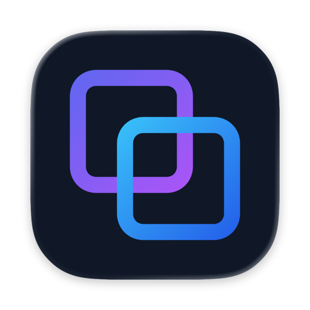
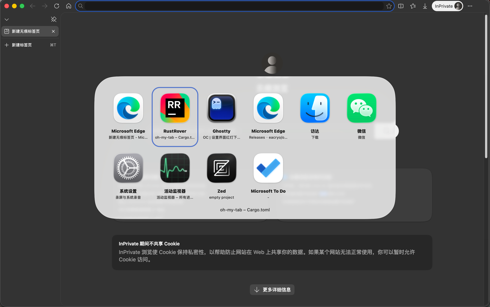
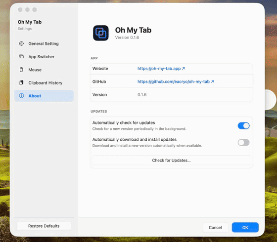

<p align="center">
  
</p>

<br />

<div align="center"><b>——&nbsp;&nbsp;&nbsp;Native macOS window switching, clipboard history, mouse controls, and quick actions&nbsp;&nbsp;&nbsp;——</b></div>

<br />

<p align="center">
  <a href="https://github.com/eacryo/oh-my-tab/releases"></a>
  <a href="LICENSE"></a>
  <a href="https://github.com/eacryo/oh-my-tab"></a>
</p>

<br />

<p align="center">
  <a href="README-ZH.md">简体中文</a> | English
</p>

<p align="center">
  Official Website: <a href="https://oh-my-tab.app/">https://oh-my-tab.app/</a>
</p>

<br />

oh-my-tab is a macOS menu-bar utility centered on window switching. It uses **Command+Tab** by default (or Option+Tab), shows open windows in a floating **Liquid Glass** overlay, and raises the selected window when the modifier is released. Window activation uses a private SkyLight API together with Accessibility APIs.

The app is written in Rust and calls AppKit, CoreGraphics, and ApplicationServices directly through `objc2` FFI, without a Swift bridge or Rust UI framework.

**Every optional feature is opt-in and off by default**: clipboard history, mouse control, window control, quick actions, the keystroke display, and filters such as hidden/minimized windows all have to be turned on in Settings. Windows on other macOS desktops are the one exception — they are shown by default, and the "Always show windows from other desktops" switch turns them off.

-  **Native switcher**: app names and window titles, one card per window, multiple displays; switching keeps that app's other windows in order.
-  **Window thumbnails**: a preview that follows each window's own aspect ratio (extremely wide or tall windows are narrowed to stay readable); needs **Screen Recording** permission, otherwise icon-only cards.
-  **Keyboard navigation**: Tab / Shift+Tab / arrow keys / mouse; the shortcut can be Option+Tab.
-  **Window control** (optional): Option+arrow keys maximize, snap or minimize; add Shift to move a window to the next display.
-  **Quick actions** (optional): Option+I/E/D/L open Settings, Finder, the desktop and the lock screen; double-tap Control to locate the pointer.
-  **Clipboard history** (optional): text, images and files — search, pin, delete, expiry and encrypted storage.
-  **Mouse control** (optional): scroll modes, reversal, per-device acceleration and side-button → shortcut mapping.
-  **Appearance and settings**: light / dark / system, liquid glass, tint, radius and font size, all managed in Settings.
-  **Languages and logs**: English / Simplified / Traditional Chinese following the system; rotating logs cleaned up after 30 days.

<br />

## &nbsp;&nbsp;Install via Homebrew

If you just want to use the app (no need to build from source), install the prebuilt release via Homebrew Cask:

> ```sh
> brew install --cask eacryo/tap/oh-my-tab
> ```

This taps the [homebrew-tap](https://github.com/eacryo/homebrew-tap) repo and installs `Oh-My-Tab.app` into `/Applications`. Requires macOS 13+ on Apple Silicon.

- Update: `brew upgrade --cask oh-my-tab`
- Uninstall: `brew uninstall --cask oh-my-tab`

## &nbsp;&nbsp;Screenshots

<div align="center"></div>

<div align="center"></div>

## Quick start

- **Window switching**: hold Command (or Option, if configured), press Tab / Shift+Tab or the arrow keys to pick a window, then release the modifier to switch.
- **Clipboard history**: once enabled, press **Option+V** to summon it; it supports both keyboard and mouse, and closes when you click outside.
- **Permissions**: window switching needs Accessibility permission; thumbnails need Screen Recording. Without Screen Recording, switching still works and cards simply fall back to icons.

## &nbsp;&nbsp;Clipboard history

Clipboard history is optional and off by default. Press **Option+V** to open it, then use the arrow keys, Enter, Esc, Backspace, or the mouse; clicking outside closes the picker. **← pins or unpins** the selected entry. **→ opens a detail panel** with the full text or a larger image preview; the panel follows ↑/↓ selection changes and closes with Esc, ←, →, or a click. The history records **three kinds of entries**:

| Kind | What is stored | Paste behavior |
|---|---|---|
| **Text** | The copied text, held in memory | The text is written back and Cmd+V is synthesized |
| **Image data** | An image copied inside an app (e.g. right-click → "Copy Image"): the original-format bytes are hashed and kept in a disk cache; only a downsampled thumbnail stays in RAM | The original bytes are written back under their original UTI, preserving the format: JPG remains JPG and animated GIF remains GIF |
| **Image file** | An image FILE copied in Finder (Cmd+C): read once at copy time for a content hash and a thumbnail, then the bytes are discarded — only the path is kept | `public.file-url` is restored (file semantics, like Windows Win+V / Maccy): Finder duplicates the file, chat apps attach it. If the source file has been deleted, the paste is skipped |

> **Known v1 tradeoffs** — each entry records one kind of content. A copy containing **both text and an image** (for example, an image copied from a web page) records the text. **Multiple-file copies and single non-image file copies are omitted from history.** The same picture copied as image data and as a file remains as two entries because the paste behavior differs. Deduplication is per kind: exact content for text and a content hash for images.

**Using an entry reorders the history by default** (like Maccy). Pressing Enter writes the selected entry back to the pasteboard, and the recorder treats it as a new copy and moves it to the top. The **"Move used entries to the top"** switch turns this behavior off (like Windows Win+V).

With **"Delete entry after paste"** enabled, Option+Enter or Option+click pastes the entry and removes it from history. The dependent **"Also delete the corresponding system clipboard item"** option clears the matching clipboard content after a short delay, unless a newer copy has replaced it. The two clear actions beside the filter row clear the entries you are looking at — the selected category, or the search results while a query is active — and keep pinned entries unless you pick the "clear all" one. **"Clear history on quit or shutdown"** (off by default) deletes the history file and the cached image data on an orderly exit — Command+Q, the menu's Quit, logout or shutdown — so the session leaves nothing behind.

> **Clipboard history is written to disk while the feature is on, encrypted.** Copied text, filenames, and image data are sealed with AES-256-GCM under a random key that lives in this Mac's login keychain, so the files are unreadable without it. What that does **not** cover: the history is in memory while the app runs, the metadata (file names, sizes and timestamps) is visible, copies that were already synced or backed up before you turned the feature off stay where they are, and a keychain item deleted by other tools makes the saved history unreadable for good. Without keychain access the feature is unavailable and nothing is recorded (no in-memory fallback); the settings page, the history panel and a system notification all say so, with a **Grant Keychain Access** action on the two in-app surfaces that asks for the keychain password once. Leave the feature off if you copy passwords or tokens, or turn on **"Clear history on quit or shutdown"**. A crash or a force quit cannot run that cleanup. See the [official website](https://oh-my-tab.app/) for details.

## &nbsp;&nbsp;Known Issues

**Background-app thumbnails**: blank captures are rejected before caching, so an existing valid thumbnail is retained. A suspended WebView window keeps its last valid frame; before its first activation, the card shows a placeholder. Switching to the window refreshes its preview. Appearance changes also refresh placeholder frames to avoid showing an image from the previous theme.

**A minimized window that was never captured shows a placeholder**: the summon refresh skips minimized windows, so a window whose thumbnail had never been captured before it was minimized keeps the placeholder. Selecting its card, or activating the app, captures it and the thumbnail is kept from then on. This happens at most once per window per launch; it is most visible with a native-tab window after switching to a not-yet-captured tab and minimizing immediately.

**Telegram's fullscreen image viewer has no separate thumbnail**: Telegram's media viewer is a special high-level floating window above its normal windows. To avoid treating it as a separate switchable window, oh-my-tab excludes it from the window list and thumbnail capture. While the viewer is open, the switcher displays Telegram's main-window thumbnail.

**Some application windows may be unavailable to thumbnail capture**: Certain applications mark editor or other protected windows as non-shareable, or render their content on a protected surface. The window remains switchable, but its thumbnail may stay on the placeholder or last valid frame.

**Windows that snap to a content grid keep a thin strip after maximizing**: an app that rounds its window size to whole content units cannot fill the visible area exactly, so a strip about one unit tall (one text row for terminals) stays on one edge. Terminal is the common example. This is the app's own maximize result -- the green button, Option+clicking it, and double-clicking the title bar all leave the same strip, and neither a slightly larger size request nor the system's window tiling changes it. Apps that do not snap to a grid (Finder, browsers, editors, and most others) maximize exactly.

If windows are already open when the app starts, their initial ordering is seeded from WindowServer's front-to-back order. This provides an initial approximation; live activation events refine the window-level MRU after launch.


Development-only issues and raw-binary debugging notes are collected in [docs/developer-notes-en.md](docs/developer-notes-en.md).

## &nbsp;&nbsp;Requirements

- macOS 13+ on Apple Silicon.
- **Accessibility** permission granted to the app.

## &nbsp;&nbsp;Build & run

**Prerequisites:** Rust stable toolchain, Xcode Command Line Tools (`xcode-select --install`), macOS 13+. Accessibility permission is required at runtime (see Permissions below).

### Development

> ```sh
> cargo fmt
> cargo check       # fast type-check
> cargo clippy
> cargo test        # unit tests; add -- --ignored for the CG/AX smoke tests
> ./scripts/dev-restart.sh  # build, sign, and launch the development .app
> ```

`scripts/dev-restart.sh` builds the development `.app` and re-assembles and re-signs it only when its inputs changed, then launches it through the per-user `launchd` domain. It signs with an Apple-issued identity when one is installed (the self-signed certificate is the only accepted fallback, and ad-hoc signing is refused; a failure to sign with the Apple identity fails the build unless `--allow-signing-fallback` asks for the self-signed one). A stable identity is what keeps Accessibility, Screen Recording and keychain grants alive across rebuilds, so a restart without changes reuses the existing bundle; layout QA fixtures, debug-only layout assertions and the GUI smoke test are documented in [docs/developer-notes-en.md](docs/developer-notes-en.md). Layout QA fixtures, debug-only layout assertions, and the GUI smoke test are documented in [docs/developer-notes-en.md](docs/developer-notes-en.md).

### Release

> ```sh
> sh scripts/bundle.sh        # cargo build --release -> .app -> sign -> .dmg + Sparkle .zip
> open dist/Oh-My-Tab.dmg     # install: drag Oh-My-Tab into Applications
> ```

`bundle.sh` assembles `dist/Oh-My-Tab.app` (release binary, `Info.plist`, and app icon resources), signs it, then packages `dist/Oh-My-Tab.dmg` (with an `Applications` symlink for drag-to-install) and the Sparkle archive `dist/Oh-My-Tab.zip`. The outputs live in `dist/` (gitignored), outside `target/`, so the logger treats them as production builds (file logging, not stdout); running the `.app` is what enables launch-at-login (SMAppService) and file logging. Re-run the script after code changes — it copies the release binary at build time and self-locates the repo root.

The full release pipeline (`release.sh` / `release-dev.sh`, including `--push`), the isolated development channel (bundle ID `com.eacryo.oh-my-tab.dev`), the R2 upload flow, Sparkle automatic updates, and code signing are documented in [docs/releasing-en.md](docs/releasing-en.md).

## &nbsp;&nbsp;Permissions & runtime caveats

**Important for upgrades from 0.2.2 or earlier:** After installing the new version, manually remove the old Oh My Tab entry from both **Accessibility** and **Screen & System Audio Recording** (shown as **Screen Recording** on some macOS versions) under *System Settings → Privacy & Security*. In each list, select the old entry and click **−**, then click **+** and add the new `Oh-My-Tab.app` from Applications; turn on both permissions. Toggling the existing switches off and on is not enough. Restart Oh My Tab after re-adding it.

- The app requires **Accessibility** permission (`AXIsProcessTrusted`) for both the global key event tap and the AX window queries. Grant it under *System Settings → Privacy & Security → Accessibility*. A freshly built binary must be re-granted — unless you sign with a stable identity (see [Code signing](docs/releasing-en.md#code-signing-why-a-self-signed-certificate-stabilizes-permissions)), in which case the grant persists across rebuilds.
- **Window thumbnails** additionally require the **Screen Recording** permission (System Settings → Privacy & Security → Screen Recording). A private WindowServer capture API is used, as in DockDoor. Without permission, the switcher falls back to icon-only cards; granting it later resumes thumbnail capture without restarting. Window frames are kept in memory rather than written to disk.
- If the event tap fails to start, the shortcut does not respond. This usually indicates that Accessibility permission has not been granted.
- Icon cache: `~/Library/Caches/oh-my-tab-icons/{bundle-id}.png` (keyed by bundle id, with a `.meta` mtime sidecar; clearable from the menu).

## &nbsp;&nbsp;Settings

Options are managed from the in-app Settings window, and most changes take effect immediately. The window covers appearance, window switching, window control, quick actions, clipboard history, mouse control, startup, and updates.

## &nbsp;&nbsp;Logging

- **Destination**: the development `.app` launched by `scripts/dev-restart.sh` and packaged `.app` builds write to the log file. A raw `cargo run` writes to stdout and is reserved for low-level diagnostics; use `scripts/dev-restart.sh` for normal development runs.
- **Default file path**: `~/Library/Logs/oh-my-tab/oh-my-tab.log`. When the active file reaches 10 MB, it rolls through `oh-my-tab.log.1` to `oh-my-tab.log.5` and keeps the newest five backups. Each launch writes a session marker so runs remain distinguishable. Legacy per-launch logs and stale backups older than 30 days are deleted at startup.
- **Log level**: can be changed from the Settings window when troubleshooting is needed.
- **Memory diagnostics**: at the `info` log level, after roughly 60 seconds and then every 5 minutes, the app records one `[mem]` line containing the active feature profile (`mouse:on|off`, `thumbs:on|off`, `clipboard:<on|off>/<keep|clear_on_quit>`), process footprint/RSS, sampled footprint peak, thread count, and estimated thumbnail/clipboard/window ledgers. `footprint` is the macOS physical-footprint metric used for the Activity Monitor Memory column and is the primary number for memory pressure; `rss` is current resident memory and can fall as macOS compresses or reclaims pages. `footprint_peak_sampled` is sampled by the app, while `rss_peak_kernel` is the kernel's lifetime high-water mark. Clipboard memory is split into text, preview, and metadata estimates; original image bytes in the disk cache are not counted as resident memory. `clear_on_quit` changes history lifetime, not the per-entry RAM model. Clipboard contents and window imagery are excluded from the log.
- **Privacy**: debug logs record only `Tab` / `Command` / `Option` (and the summon combo name) from the switcher's key tap; every other key is logged as plain `Other`, without keycodes or modifier details.

## &nbsp;&nbsp;Credits

The **mouse control** feature (scroll reversal, scroll modes, per-device configuration, and pointer-acceleration control) is inspired by [LinearMouse](https://github.com/linearmouse/linearmouse). The corresponding functionality is implemented in Rust through `objc2` FFI and integrated with oh-my-tab's configuration model. Many thanks to the original author and the LinearMouse project for their work.

The **window switcher** (overlay design, card-based selection, and Liquid Glass styling) draws inspiration from [BetterCmdTab](https://github.com/rokartur/BetterCmdTab). Its implementation uses Rust and `objc2` FFI. Many thanks to the author.
